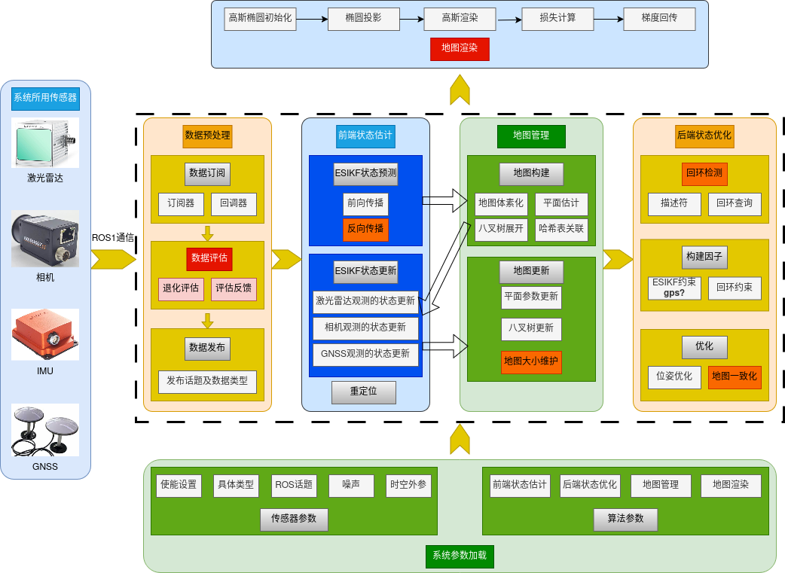

# 技术文档
## 1. 介绍
整个系统分为六个部分，配置参数管理，传感器管理，前端状态估计管理、后端状态优化管理、地图管理以及地图渲染。其中
- 参数管理负责修改和加载传感器及系统所需的参数；
- 传感器管理负责传感器数据的采集和评估；
- 前端状态估计管理负责基于数据估计系统状态；
- 后端状态优化管理负责状态估计的优化；
- 地图管理负责地图的生成和更新；
- 地图渲染负责实现新视图合成（临境感）。

📢 本系统采用C++语言编写，并使用ROS框架进行开发，编程风格遵守Google开源项目风格指南。 感谢https://github.com/yqmy0814对第三方库和LRU的整合和设计，为我从0复刻LIVO2提供了很大帮助！

## 2. 系统架构

<div align="center">
    
</div>

其中红色框为课题拟研究点，橙色框为工程实现中需补充的重要点。

系统中每部分将采用命名空间&类封装实现模块化设计，每个命名空间负责一个部分，每个类负责部分中的某个功能。

### 2.1 配置参数管理
该部分对应命名空间为 common，含义为通用，不仅包括配置类，还包括工具类（日志打印，耗时统计，计时器，文件路径操作等）。

#### 2.1.1 配置类
配置类负责加载和修改配置参数，包括传感器参数，系统参数（前端，后端），地图参数等。配置类包括以下类：

- Config：配置类，负责加载和修改配置参数。

目前由构造函数实现参数的配置，参数的传入采用ROS参数服务器（rosparam），参数的修改通过修改配置文件实现。

参数文件采用yaml格式，并根据参数类型分为传感器参数和前端参数，后端参数，地图参数等。本系统将不同的类型封装为结构体，并在Config类中声明对应的成员变量，通过构造函数实现参数的加载。

2025/06/23：

已完成：参数类型中传感器参数和前端参数的结构体封装。待完成：需要调整的部分，将结构体中的默认值删除，通过nh.param设置默认值。

2025/06/24：

已完成：仅通过rosparam设置默认值，传感器和前端参数加载；launch文件编写（使用了ros自带的图像类型转换节点）；主函数关于config部分；CmakeLists.txt文件关于config的基础部分；给config类写一个检查函数，并打印配置成功或失败信息。

编译错误：

```bash
/media/ser/DATA/Projects/mapping/ws_rlivgs/src/rliv_gs/src/common/config.cpp:17:82:   required from here
/opt/ros/noetic/include/ros/node_handle.h:2124:7: error: cannot bind non-const lvalue reference of type ‘int&’ to an rvalue of type ‘int’
 2124 |       if (getParam(param_name, param_val))
```
原因：yaml文件中的tpye: 0, 不能通过rosparam直接给枚举类型变量赋值。

解决：将paramter.hpp中的类型改为int，在后续判断传感器类型时，使用static_cast<>()进行显式转换，再比较。

#### 2.1.2 工具类
工具类负责实现一些常用的功能，包括日志打印，耗时统计，计时器，文件路径操作等。工具类包括以下类：

- Utils ：工具类，负责实现一些常用的功能。

工具类中的成员函数采用static修饰，可以直接通过类名调用，避免了实例化对象的开销。

2025/06/24：

已完成：采用枚举类型设置字体颜色和样式；工具类的打印函数设计，自定义终端打印形式，输入文本，颜色及样式即可。

### 2.2 传感器管理
该部分对应命名空间为 sensor，含义为传感器，负责传感器数据的采集、评估及发布。

#### 2.2.1 传感器订阅类
传感器订阅类负责订阅传感器数据，并将数据存储到传感器对象中。传感器订阅类包括以下类：

- SensorSubscriber：传感器订阅类，负责订阅传感器数据，并用回调函数实现。

2025/06/24：

已完成：传感器订阅类的实现，包括传感器数据的订阅，回调函数的声明。待完成：回调函数的实现，将传感器数据存储到传感器对象中。

2025/06/25：

补充完Cmakelists.txt文件中关于sensor的部分。编译报错：不能调用私有类型。解决：设计获取参数函数，来返回各参数体。此外为避免枚举值与int的直接比较，采用显式转换：static_cast<>()。

编写激光雷达回调函数：

如果出现数据时间回滚应该如何应对？ 清空对应缓存器，并返回。 
Fast_xx系列判断激光雷达点间时间大于1.0ms时会手动计算时间间隔，若确实部分点未返回，这种手动赋值反而会导致点时间戳错位。 此外，Fast系列用曲率属性表示时间，不易理解，换成有时间戳的点类型更好。 但pcl没有这种类型的，所以需要自己实现。

编译错误：

```bash
/media/ser/DATA/Projects/mapping/ws_rlivgs/src/rliv_gs/include/rliv_gs/sensor/custom_point_type.hpp:14:10: fatal error: pcl/point_types.h: 没有那个文件或目录
   14 | #include <pcl/point_types.h>
```
原因：CMakeLists.txt文件中关于pcl的依赖没有添加。 解决：添加CMakeLists.txt文件中关于pcl的依赖。 

编译错误：

```bash
/media/ser/DATA/Projects/mapping/ws_rlivgs/src/rliv_gs/include/rliv_gs/sensor/custom_point_type.hpp:28:1: error: ‘name’ is not a class template
   28 | POINT_CLOUD_REGISTER_POINT_STRUCT(PointXYZIRT,
```
原因：自定义进行类型注册时，是不可以在命名空间内进行的。解决：将自定义类型注册的代码移到命名空间外。

编译错误：

```bash
error: expected ‘{’ at end of input
   29 | odeHandle& nh, const common::Config& config) : config_(config);
```
原因：不能在构造函数声明时对成员变量进行初始化。解决：将成员变量初始化移到构造函数定义中。

编译警告：

```bash
/usr/include/pcl-1.10/pcl/pcl_macros.h:94:9: note: declared here
94 | using uint16_t [[deprecated("use std::uint16_t instead of pcl::uint16_t")]] = std::uint16_t;
```
原因：自定义点类型时使用了pcl被弃用的类型。解决：将pcl库中使用的类型替换为std库中的类型。

编写imu回调函数：未发生错误。

编写相机回调函数：

编译错误：

```bash
/usr/bin/ld: /media/ser/DATA/Projects/mapping/ws_rlivgs/devel/lib/libsensor.so: undefined reference to `cv::Mat::copySize(cv::Mat const&)'
/usr/bin/ld: /media/ser/DATA/Projects/mapping/ws_rlivgs/devel/lib/libsensor.so: undefined reference to `cv::Mat::deallocate()'
/usr/bin/ld: /media/ser/DATA/Projects/mapping/ws_rlivgs/devel/lib/libsensor.so: undefined reference to `cv_bridge::toCvCopy(boost::shared_ptr<sensor_msgs::Image_<std::allocator<void> > const> const&, std::__cxx11::basic_string<char, std::char_traits<char>, std::allocator<char> > const&)'
/usr/bin/ld: /media/ser/DATA/Projects/mapping/ws_rlivgs/devel/lib/libsensor.so: undefined reference to `cv::fastFree(void*)'
```
原因：CMakeLists.txt文件中关于cv_bridge和OpenCV的依赖没有添加。解决：添加CMakeLists.txt文件中关于cv_bridge和OpenCV的依赖。

#### 2.2.2 传感器发布类

传感器发布类负责发布传感器数据：

- SensorPublisher：传感器发布类，负责发布传感器数据。

2025/06/25：

已完成：传感器发布类的实现，包括部分传感器数据的发布。待完成：其他传感器数据的发布。

#### 2.2.3 传感器评估类

传感器评估类负责评估传感器数据：

- SensorEvaluator：传感器评估类，负责评估传感器数据。

2025/06/25：

完成：传感器评估类框架的实现。待完成：评估算法实现（延后），数据预取函数--将缓存器中的数据放到观测组中。

2025/06/26：

计划：设计函数，将同一个时间段内的点云，imu和相机数据取出来，放到观测组中，等待后续处理。

已完成：设计函数，将同一个时间段内的点云，imu和相机数据取出来，放到观测组中，等待后续处理。待完成：完善main.cpp，完整测试参数加载和传感器数据处理模块。

2025/06/27：

计划：将整个系统封装为一个类型，其他模块的初始化，在系统初始化时完成。待完成：系统类的实现，并完整测试参数加载和传感器数据处理模块。

编译错误：

```bash
/media/ser/DATA/Projects/mapping/ws_rlivgs/src/rliv_gs/include/rliv_gs/sensor/sensor_measurement.hpp:54:5: error: ‘cv’ does not name a type
   54 |     cv::Mat camera_data; // Camera image data in OpenCV format
```C++
cv::Mat
```
原因：，没有包含OpenCV的头文件。解决：添加OpenCV的头文件。

编译错误：

```bash
/media/ser/DATA/Projects/mapping/ws_rlivgs/src/rliv_gs/src/main.cpp:8:13: error: ‘SensorPublisher’ is not a member of ‘sensor’
    8 |     sensor::SensorPublisher sensor_pub(nh);
```
疑问：明明在命名空间sensor中声明和定义了SensorPublisher类，为什么编译器找不到？
原因：几把玩意的自动补全，把评估文件的防御性编程命名为了SensorPublisher，导致编译器找不到真正的SensorPublisher类。解决：修改评估文件的防御性编程命名，使其与SensorPublisher类名区分。

运行问题：

写了一个判断回调函数是否激活的函数，回调函数激活了，但这个函数却返回false。也就是 在调用函数isCallbackActive时，config_.getFrontendParam().mode是随机值。因此无法正常判断。

原因：在构造函数初始化列表中，我采用的是 config_(common::Config(nh))，声明采用的是 const common::Config&，但在初始化列表中它引用了一个临时对象 common::Config(nh)。这个临时对象在构造函数结束后会被销毁，导致 config_ 引用了一个已经不存在的对象，这是一个悬空引用（dangling reference）。之后在其他函数中访问 config_ 时，会访问到已被销毁的内存区域，导致未定义行为，这就是为什么返回的配置值不正确。

运行问题：

同步数据时一直提醒相机的数据时间戳晚于最新的激光雷达数据时间戳，导致无法同步。

差0.01是因为yaml文件中的初始曝光 exposure_time_init 名字和config中不一致，因此采用了默认的0.01。
修正后，依然会不同步，相机捕获时间总是晚于激光雷达最后一个点的时间戳，就多一点。
 Image capture time is 946685438.999809
 Newest LiDAR point time is 946685438.999652

又修改了时间戳的类型，从double改为float，但依然无法同步。

 Set the latest LiDAR inertial start time to 946685437.599356
 Image capture time is 946685437.699356
 Newest LiDAR point time is 946685437.599356
 Failed to gather synchronized data! 
 Get camera header timestamp: 946685437.799984
 Image capture time is 946685437.699356
 Newest LiDAR point time is 946685437.599356

似乎并没有加上最后一个点的时间戳？？？？

2025/06/28：

通过测试Fast-LIVO2的图像捕获时间和最新点时间，最后一帧的最后的点总是比相机捕获时间多0.1s。

img_capture_time: 1590192890.599603, lid_newest_time: 1590192890.699273, imu_newest_time: 1590192890.699998

根据这个现象还是很难分析出原因，因此我决定从回调函数入手，看看是不是回调函数的问题。

FastLIVO2 的 ros::Rate rate(5000);  我的为 ros::Rate rate(100);

出现一个问题，我的第一帧点云时间为： Get lidar header timestamp: 1590192889.799353，而FastLIVO2的第一帧点云时间为：Get lidar header timestamp: 1590192889.899998，但如果将我的 ros::Rate 设为5000，则第一帧点云时间为：Get lidar header timestamp: 1590192889.899998，与FastLIVO2的第一帧点云时间相同。

可是若将 FastLIVO2 的 ros::Rate 设为 100，则第一帧点云时间还是为：Get lidar header timestamp: 1590192889.899998，没有任何变化！

题外话：检查自己代码时候发现一个问题（并不一定就是时间戳不对的原因）：我在回调函数里给cloud_ptr赋值之前有下面一段代码明显不合理：

```cpp
        float distance = std::sqrt(cloud_ptr->points[i].x * cloud_ptr->points[i].x +
                                cloud_ptr->points[i].y * cloud_ptr->points[i].y +
                                cloud_ptr->points[i].z * cloud_ptr->points[i].z);
```
此时cloud_ptr->points[i]还没有被赋值，因此这段代码是错误的。

修改完成后，运行到检查两点时间差部分时候，我这里总是出现时间差大于1.0ms的情况。还有个问题，就是cloud_ptr->reserve(point_num);采用的reserve，推数据的时候需要采用push_back。

解决：推数据的时候需要采用push_back，并且将盲区判断放到时间差判断之后，否则剔出盲区内的点后，时间差会错误，变大。

继续 ros::Rate 设为 100后 第一帧点云时间对不上的问题，使用我的数据集，FastLIVO2读取不到第一帧，我的可以，使用Retail_Street.bag数据集，FastLIVO2可以读取到第一帧，我的却读取不到。
经过几次实验，这和数据集没有关系，和ROS RATE也没有直接关系，似乎是随机发生的。

 **问题总结：C++ subscriber 第一条消息没有执行回调，FastLIVO2一样存在这个问题**

解释：目前没有看到让我完全信服的解释。

继续之前相机时间戳晚于激光雷达数据时间戳的问题: 

```bash
 Initializing frontend ... 
 Set the latest LiDAR inertial start time to 1590193513.499980
 Image capture time is before the last LiDAR-inertial fusion start time! 
 Failed to gather synchronized data! 
.
.
.
 Image data buffer is empty! 
 Failed to gather synchronized data! 
 Get camera header timestamp: 1590193513.599980
 Publishing global lidar with 23601 points 
 Lidar data buffer is empty! 
 Failed to gather synchronized data!
```
相机缓存器和激光雷达缓存器空的问题会交替出现，FastLIVO2也有。

原因：数据是以10hz的频率发布的，但回调函数是以5000hz的频率执行的，因此会出现缓存器空的情况。

写了一个重置回调函数状态的函数，回调函数被激活后会进行同步，同步完成后，重置回调函数状态，下次回调函数被激活时，再进行同步。

至此，参数管理和数据处理模块(除了数据评估算法)全部完成。下一步将进行前端模块的开发（前端模块开发完后再研究数据评估算法和Gnss的加入）。

### 2.3 前端状态估计
该模块包括IMU状态初始化，前向传播，后向传播，状态更新。其中在状态更新之前涉及地图管理的设计。

对应的命名空间为frontend，主要的类是基于ESIKF的状态估计。使用者只需要调用状态估计的接口即可，无需关心具体的实现细节。

两个类：SystemState和Esikf。


#### 2.3.1 IMU状态初始化
2025/06/30:

既然是状态估计，那么就需要一个状态向量。要实现ESIKF脱离于具体的状态，就需要将状态向量抽象出来，通过调用ESIKF的setStates来自定义的设置状态是什么，从而实现ESIKF的通用性。
状态向量如何抽象出来呢？可以采用模板类，将状态向量作为模板参数传入，从而实现状态向量的抽象。// IKFOM也并非广义上的通用工具，也是只针对机器人状态设计的。

2025/07/01:

构造一个状态结构体，包含状态量：旋转，平移，速度，Imu陀螺仪偏差，IMU加速度偏差，重力，imu角速度，imu加速度, 逆曝光时间；
状态协方差矩阵：由上一一时刻的状态协方差矩阵，状态转移矩阵，噪声协方差计算得到；

需要Eigen库来表示类型，eigen_conversions来进行类型转换，输出为geometry_msgs。

完成状态类的设计后，下面是关于ESIKF的设计，但在系统进行预测之前，需要先进行IMU的初始化，IMU的初始化包括IMU的校准和IMU的初始化，IMU的校准包括IMU的零偏校准和IMU的尺度校准，IMU的初始化包括IMU的初始位置和IMU的初始速度。

思路是，在系统的run函数中判断是否使用了imu以及是否是第一次运行，如果是，调用esikf的imu初始化函数，判断是否达到初始化标准，达到则设置第一运行标志为false, 否则继续初始化。

已完成：系统状态结构体以及imu初始化部分的代码编写。待完成：明天可以进行测试，测试是否能够正确初始化IMU。

2025/07/02:

测试IMU初始化部分，发现初始化部分有问题，运行到初始化部分系统会崩溃。
经过检查，发现是观测组中的IMU队列为空，因此无法进行初始化，下面将检查为什么是空的。
检查发现是imu队列的头部时间大于图像捕获时间，因此无法将IMU数据放入IMU队列中，下面将检查为什么头部时间大于图像捕获时间。
检查发现是imu头部时间在一开始确实是大于图像捕获时间的（报错的原因），但随着数据累积，头部时间是会小于图像捕获时间的。FastLIVO2也是这样。

```bash
 imu_newest_time 1590192499.801405
 imu_oldest_time 1590192499.801405
 image_capture_time 1590192499.599474

 imu_newest_time 1590192499.901414
 imu_oldest_time 1590192499.801405
 image_capture_time 1590192499.699303
 Image capture time is before the last LiDAR-inertial fusion start time! 
 Failed to gather synchronized data! 


 imu_newest_time 1590192499.997379
 imu_oldest_time 1590192499.801405
 image_capture_time 1590192499.799927   报错发生位置  这里图像捕获时间大于激光雷达帧头时间但依然小于imu头部时间，会跳过imu测量获取，因此队列为空。

 imu_newest_time 1590192500.197563
 imu_oldest_time 1590192499.801405
 image_capture_time 1590192499.899768
```
解决办法，在gatherSynchronizedData 里也加上对imu头部时间的判断。

imu初始化功能测试完成！ 接下来完成ESIKF的前向传播和后向传播。

#### 2.3.2 状态预测
实现之前先改下逻辑，将初始化放到前端阶段判断里，若是初始化失败也需要切换阶段，保证弹出老的图像，避免失败后妨碍下次初始化。

完成到F_x阵设置时候，需要用到罗德里格斯公式中的Exp变换和反对称阵变换，准备在utils.hpp中实现这两个函数。

已完成：F_x_阵设置，Exp变换和反对称阵变换的实现。待完成：协方差阵设置。

2025/07/03:

完成协方差阵设置，需要对状态进行前向预测。注意加速度和角速度是imu系下的，且预测阶段的噪声都设为0，故重力，偏差和IMU系下的加速度和角速度都不更新。

完成过程噪声和F_x的设置后，在进行状态协方差预测时，只要state_covariance = F_x_ * state_covariance * F_x_.transpose() + Q_;就会导致报错：

```bash
/usr/bin/ld: /media/ser/DATA/Projects/mapping/ws_rlivgs/devel/lib/libfrontend.so: undefined reference to `omp_get_max_threads'
/usr/bin/ld: /media/ser/DATA/Projects/mapping/ws_rlivgs/devel/lib/libfrontend.so: undefined reference to `omp_get_num_threads'
/usr/bin/ld: /media/ser/DATA/Projects/mapping/ws_rlivgs/devel/lib/libfrontend.so: undefined reference to `omp_get_thread_num'
```

显式链接target_link_libraries(fusion_mapping  ..... 到${OpenMP_CXX_FLAGS}就可以了。

编写后向传播代码。

已完成：前向传播代码编写，后向传播代码部分编写。待完成：后向传播代码完成并测试。

2025/07/04:

编写后向传播代码,去畸变部分，我采取与Fast-LIVO2一样的策略，保留了原始点和去畸变点。

完成去畸变代码，接下来是状态更新部分，但是在状态更新之前，需要先进行地图管理的设计。

#### 2.3.3 状态更新
2025/07/07:
基于2.4的地图管理设计。

##### 2.3.3.1 设计基于激光雷达观测的状态更新函数。

考虑激光系点转到全局系的函数设计。

考虑如何计算激光雷达观测的残差值。

下面需要设计单个点残差的计算。

已完成：体素地图管理器等相关功能设计，以及esikf状态更新函数的部分设计。待完成：esikf状态更新函数中的残差函数设计。

2025/07/08:

设计单个残差计算函数

2025/07/09:

单个残差函数需要用到sophus库，更新CMakeLists.txt文件，添加sophus库

需要给八叉树增加一个获取叶的函数。

就算观测雅可比之前，尝试将需要的Sophus和vikit作为子文件夹放到项目中，这样就可以直接使用，而无需在CMakeLists.txt中添加库的路径。

编译报错：

```bash
/home/pf/ws_rlivgs/src/rliv_gs/vikit_common/include/vikit/atan_camera.h:18:10: fatal error: Eigen/Eigen: 没有那个文件或目录
   18 | #include <Eigen/Eigen>
      |          ^~~~~~~~~~~~~
compilation terminated.

```

修改vikit_common中CMakeLists.txt文件，将${Eigen_INCLUDE_DIRS}改为 ${Eigen3_INCLUDE_DIRS}，这个报错消失了，但又出现了新的报错，因此，将其替换为${EIGEN3_INCLUDE_DIR}

报错解决。

关于下面的报错，是因为我错把该行代码认为是李群运算，其实是概率论中的指数分布，因此不需要Sophus库。

```bash
esikf.cpp:439:41: error: ‘exp’ is not a member of ‘Sophus’
  439 |                                 Sophus::exp(-0.5 * dis_to_plane * dis_to_plane / sigma_l);
```
已完成：关于Sophus库和vikit库的本地化，以及明确观测雅可比的相关状态量。待完成：观测雅可比矩阵的设计。

2025/07/10:

设计观测雅可比矩阵。 需要重新设计状态的运算符的重载。
完成状态更新函数设计，下面将设计一个系统函数将预测和更新串起来。

2025/07/11:

开始设计系统处理LIO函数，将预测和更新串起来。后续将添加一个状态信息输出文件功能。

完成自定义点云的体素滤波器。

完成handleLio函数设计，下面可以写点云发布函数，测试LIO部分（还有很多坑要补）。

测试报错：

预测阶段完成后出现无效指针问题
```bash
free(): invalid pointer

出现 free(): invalid pointer 错误通常意味着您尝试释放一个无效的指针。这可能是由以下几种情况引起的：

1、多次释放同一块内存：如果一个指针所指向的内存已经被释放过一次，再次释放该指针会导致未定义行为。

2、释放非动态分配的内存：只有使用 malloc(), calloc(), realloc() 或 new 分配的内存才能被 free() 或 delete 释放。如果尝试释放一个指向非动态分配内存的指针（例如，一个局部变量的地址或数组的地址），也会导致这个错误。

3、释放已经解引用的指针：如果指针在释放前已经被解引用（即，指向的内存已经被释放），再次释放会导致这个错误。

4、使用未初始化的指针：如果尝试释放一个未初始化的指针，也会导致这个错误。
```
在解决这个问题之前，通过打印体素滤波后的点数发现，滤波后的点数是1，因此，需要检查体素滤波器是否正确。将点云转为PCLpointcloud2后，数据并没有变为0，经过检查是设置的体素大小问题，需要先运行loadVoxelMapConfig函数，设置体素大小，再进行体素滤波。

问题定位到函数 map_manager.buildMap(esikf_.getCurrentState());

进一步定位到：
```bash
    if (voxel_map_cache_.size() >= voxel_map_config_.capacity) {
        common::Utils::printColored(" Check map capacity! ", common::Color::kGreen, common::Style::kBold);
        while (voxel_map_cache_.size() >= voxel_map_config_.capacity) {
            voxel_map_.erase(voxel_map_cache_.back().first);
            delete voxel_map_cache_.back().second;
            voxel_map_cache_.pop_back();
        }
    }
```
原来是没有设置体素地图的缓存大小，默认0。

测试问题：没有看到发布的全局点云。

推测是状态估计有问题，但还是想看看全局点云什么样子，故保存pcd文件，查看点云。 结果什么也没有，看来是状态估计有问题。

补充Utils类，将相关信息保存为文件查看。

果然，从预测阶段的状态就是错的。先检查预测阶段问题出在哪里。

重新推了一下公式，改正了预测阶段系统协方差的一部分形式，再关闭更新函数，发现预测的值并没有什么问题，那么问题就出在更新阶段了。

2025/07/12:

检查更新阶段的错误: ProcessImu();函数会在LIO阶段会记录此时的预测状态和VIO阶段的更新状态，然后就直接运行HandleLIO()函数，首先输出状态量，对点云进行降采样，根据此刻的状态将其转到全局系，如果是第一次运行Lio则先构建八叉树。构建八叉树需要计算点的不确定性，最后初始化八叉树。初始化八叉树需要初始化平面，之后需要切割八叉树。  构建完八叉树后就开始进行状态估计，计算完全局点协方差后构建激光雷达残差。 激光雷达残差有单个点残差计算。**发现问题1：计算完毕残差，累加总残差时，发现自己没有加绝对值。**  状态更新完后就更新体素地图。更新地图中的更新八叉树地图后需要设置，**发现问题2：没有将列表的迭代器头部给哈希表中的迭代器，导致更新后的索引都是错的。 **
```bash
iter->second->second->updateOctoTree(point);
voxel_map_cache_.splice(voxel_map_cache_.begin(), voxel_map_cache_, iter->second);
iter->second = voxel_map_cache_.begin(); //这一行被我忘了
```
目前检查出这两处错误，测试后再看是否有其他错误。

测试后数据还是不对：
```bash
downsampled point num: 23645
effective point num: 1049
average residual: 0.015636
downsampled point num: 23645
effective point num: 0
average residual: -nan
downsampled point num: 23645
effective point num: 0
average residual: -nan
downsampled point num: 23645
effective point num: 0
average residual: -nan
downsampled point num: 23645
effective point num: 0
average residual: -nan
```
可以看到循环一次之后的有效点数就变为0了，也就是map_manager_.getPointToPlaneList().size() 为0，这个向量由 
```bash 
buildLidarResidual(map_manager_.getPointsWithCovariancesList(), map_manager_.getPointToPlaneList());
```
计算得到。现在有两种可能，一种是残差计算那里有个别关键值疏忽了（局部点的协方差没有更新？），一种是后续更新时候有错误（添加上角速度和加速度后协方差的逆出现问题了？）。

先在预测中去掉角速度和加速度两个状态量的相关值，结果依然不对。

再分析：第一次计算的残差是对的说明预测阶段提供的状态没问题，在第二次迭代的时候，需要更新后的状态重新计算一次点的协方差值，然后再计算残差，打印更新后的状态就知道是哪个的问题了。
```bash
 iter: 0
 euler_cur: 0.019706, -0.021577, -0.028893
 position_cur: 0.000619, -0.000236, -0.000456
 velocity_cur: 0.013011, -0.006097, -0.009254
 gyro_bias_cur: 0.000000, 0.000000, 0.000000
 acc_bias_cur: 0.000000, 0.000000, 0.000000
 exposure_time_cur: 1.000000

 iter: 1
 euler_cur: 0.019706, -0.021577, -0.028893
 position_cur: -nan, -nan, -nan
 velocity_cur: -nan, -nan, -nan
 gyro_bias_cur: -nan, -nan, -nan
 acc_bias_cur: -nan, -nan, -nan
 exposure_time_cur: -nan
```

打印结果说明在进行状态更新时候出现了问题！
当前状态 +=更新量之后错误，说明问题出在更新量上。

2025/07/13:

通过打印发现更新量都是nan值。

经过检查，第一次两个状态相减后的误差都是0值，逻辑上应该是正确的。

```bash
 euler_cur: 0.000000, 0.000000, 0.000000
 position_cur: 0.000000, 0.000000, 0.000000
 velocity_cur: 0.000000, 0.000000, 0.000000
 gyro_bias_cur: 0.000000, 0.000000, 0.000000
 acc_bias_cur: 0.000000, 0.000000, 0.000000
 exposure_time_cur: 0.000000
```

打印发现K_1都是nan值。再看看HTz，第一次是正常的，G受K_1影响，所以也一定是nan值。

K_1 受 H_T_H和current_state_.getStateCovariance().inverse()的影响，所以看看这两个值。

H_T_H的值很大，类似8.47062e+06  4.53725e+06 -1.29373e+07  1.29082e+06 -1.52701e+06
current_state_.getStateCovariance().inverse() 出现了 nan值。

检查发现，current_state_.getStateCovariance()初始化时都设置为0了。 将协方差初始化为单位阵并乘以系数后，数据终于正常了。

已完成：激光雷达惯性里程计设计。待完成：视觉惯性里程计设计。

##### 2.3.3.2 设计基于相机观测的状态更新函数。

注意关于位姿的发布等到视觉部分也完成之后再写。

2025/07/15:

先给系统写一个总函数来处理VIO部分，和handleLio函数类似。

在Fast-LIVO2中，LIO更新完后将位姿和不确定点列表给了系统以便VIO使用，这里全程使用设计的地图管理器不需要再给系统。

视觉更新部分涉及的功能较多，考虑给视觉地图单独设计一个visual_map.hpp。 视觉部分太乱了，至少四个头文件。

看起来乱的原因是视觉相关头文件采用的是先在一个头文件中声明，在另一个头文件中定义，头文件之间耦合的比较深。

对于视觉组件，另外设计一个命名空间 visual, 表明这是视觉相关的组件。将组件统一用类的形式管理。

首先是视觉点，视觉点有一个属性为观察到该点的图像块，所以需要提前声明图像块类，图像块类为Patch。

其次是图像块，取消了T_f_w的逆的位置返回，成员直接表达世界系的帧的位置。

最后是帧。

已完成：视觉点，图像块，部分帧函数的设计。待完成：帧函数的实现。

2025/07/16:

完成视觉相关组的设计，整合为库，进行编译。

编译错误，疏忽了设计私有变量的获取函数。

编译错误，出现不完整的patch类定义，疏忽了包含patch头文件。

编译错误，关于不完整的定义的解决：采用前向声明的方法解决。在frame.hpp预先仅声明关于patch和point的类，另外写两个头文件和cpp文件具体展开这两个类，然后在frame.cpp中包含这两个类的头文件，point的cpp中包含patch的头文件，patch的hpp中包含point的头文件。

设计视觉地图，将视觉地图单独实现，但在地图管理器的私有成员中声明视觉地图类。

需要作出变化的地方：
1、VisualMap()用于代替LIVO2的InitializeVIO()实现视觉部分的初始化；
2、LIVO2的UpdateState函数被esikf中（忽略UpdateStateInverse）的updateStateWithCamera()代替, ComputeJacobianAndUpdateEKF只调用状态更新和状态帧更新函数，也可以忽略；需要调用函数ComputeProjectionJacobian
3、LIVO2的ProcessFrame函数被rlivgs_system的handleVio()代替；
4、忽略GetWarpMatrixAffine()函数，因为该方案会采用法向量；
5、忽略void ProjectPatchFromRefToCur()，本方案不需要对比这个；
6、暂时忽略UpdateReferencePatch的原始版本，采用LRU版本替代；
7、忽略PrecomputeReferencePatches，该函数用于被忽略的函数；
8、其余的不变化。

2025/07/22: 

设计视觉地图初始化部分。

将相机的基本参数依然沿用Fast-livo2的文件，采用yaml文件加载方式配置cam。将相机的有效性验证放到视觉地图初始化中。暂时先不管colmap格式输出的部分。

设计RetrieveFromVisualSparseMapLRU部分。

2025/07/23:

继续设计RetrieveFromVisualSparseMapLRU部分。

编译问题：
```bash
/usr/bin/ld: /media/ser/DATA/Projects/mapping/ws_rlivgs/devel/lib/libmap.so: undefined reference to `visual::Frame::~Frame()'
```
visual_map 必须和frame.cpp编译为一个库，才行。

按照执行顺序，下一个函数是更新帧状态 updateFrameState(*state_); 需要先铺垫一些内外参设置。

2025/07/24:

已完善updateFrameState(), 拟设计重置块resetGrid()函数。

已完善resetGrid()函数，下面将设计GenerateVisualMapPoints(img, pv_list);函数。

**注意：system_inv_expo_time 就是状态估计中的曝光时间，这里需要和状态估计中的曝光时间保持一致。**

已完善GenerateVisualMapPoints()函数，下面将设计insertPointIntoVisualMap函数。

已完善insertPointIntoVisualMap()函数，下面将设计UpdateVisualMap(img);函数。

已完善UpdateVisualMap()函数，下面将设计updateReferencePatch()函数。

已完善updateReferencePatch()函数，下面将设计getImagePatch()函数。

已完善getImagePatch()函数，下面将设计warpAffine()函数。

已完善warpAffine()函数，下面将设计getBestSearchLevel函数。

已完善getBestSearchLevel函数，下面将设计getWarpMatrixAffineHomography函数。

已完善getWarpMatrixAffineHomography函数，下面将设计esikf的updateStateWithCamera()函数。

把 if (total_points_ == 0) return;写到updateStateWithVision外面进行判断吧。完善updateStateWithVision。

2025/07/25：

继续完善updateStateWithVision函数，尝试在地图管理器中包含视觉地图头文件时出现以下报错：
```bash
/usr/bin/ld: CMakeFiles/map.dir/src/map/visual_map.cpp.o: in function vk::camera_loader::loadFromYaml(YAML::Node const&, vk::AbstractCamera*&)': visual_map.cpp:(.text+0x2c90): multiple definition of vk::camera_loader::loadFromYaml(YAML::Node const&, vk::AbstractCamera*&)'; CMakeFiles/map.dir/src/map/map_manager.cpp.o:map_manager.cpp:(.text+0xf10): first defined here
/usr/bin/ld: CMakeFiles/map.dir/src/map/visual_map.cpp.o: in function vk::camera_loader::loadFromYamlFile(std::__cxx11::basic_string<char, std::char_traits<char>, std::allocator<char> > const&, std::vector<vk::AbstractCamera*, std::allocator<vk::AbstractCamera*> >&)': visual_map.cpp:(.text+0x4ca0): multiple definition of vk::camera_loader::loadFromYamlFile(std::__cxx11::basic_string<char, std::char_traits<char>, std::allocator<char> > const&, std::vector<vk::AbstractCamera*, std::allocator<vk::AbstractCamera*> >&)'; CMakeFiles/map.dir/src/map/map_manager.cpp.o:map_manager.cpp: (.text+0x2090): first defined here
```
将#include <yaml_loader.h>移动到visual_map.cpp中，编译成功。

明白了为啥要把曝光时间防盗第7个位置了，在使用视觉更新状态的时候H_sub仅需H_sub.resize(H_DIM, 7)，精简观测矩阵。但是我写的状态向量将曝光时间放到了最后，看看后面怎么调整。

实现曝光时间估计的关键是把光度值放入H_sub中。

继续完善updateStateWithVision函数，还是得将曝光时间放在平移后面。

已完善updateStateWithVision函数，下面将完善handleVio()函数。

2025/07/27：

设计handleVio()函数：

完成handleVio()函数，下面将完善数据发布，并进行数据测试。

2025/07/28:

完善数据发布，并进行数据测试。

测试数据集：farmland1 

运行错误：
```bash
初始化后就直接进入了VIO，此时LIO并没有运行
```
解决：判断运行完毕一帧LIO后再运行VIO。

运行错误：第一帧VIO，系统崩掉。
```bash
[ VIO ] Raw point num: 23645
[mapping-2] process has died [pid 13871, exit code -11, cmd /media/ser/DATA/Projects/mapping/ws_rlivgs/devel/lib/rliv_gs/fusion_mapping __name:=mapping __log:=/home/ser/.ros/log/ca3f97e0-6b57-11f0-9f7b-5d7b24f50871/mapping-2.log].
log file: /home/ser/.ros/log/ca3f97e0-6b57-11f0-9f7b-5d7b24f50871/mapping-2*.log
```
先定位在何处崩溃，再解决。

定位到崩溃位置：map_manager.getVisualMapPtr()->updateFrameState(esikf_.getCurrentState());

进入到此函数，继续定位

定位到位置：new_frame_->setPoseFrameWorld(Tcw);

解决：怀疑new_frame_没有被正确初始化？ 证明是对的，因此改为独享指针后，再封装一次，避免new_frame_的暴露。

效果错误：VIO没有正确绘制视觉点，点云纹理是空白的。

新增加的视觉地图点数量不对，进行排查：1、retrieveFromVisualSparseMap中的应该判断visualpoint_map_.size()而不是voxel_map.size()，进行修正；
2、第一次运行VIO时，是不进行状态更新的，因此visualpoint_map_为空，需要增加判断，当total_points_不为0时才进行状态更新和状态帧更新；
3、第一次运行VIO，首先运行map_manager.getVisualMapPtr()->generateVisualMapPoints，其视觉点生成数量不对。 
3.1: 检查pc_list.size() = 23645，说明点云数据没有问题；
3.2: 检查数据时间戳，发现图像时间戳和此时处理的雷达时间戳不一致。
```bash
IMU初始化后，Fast-LIVO2的时间戳：
[ Data Cut ] imu_newest_time: 1590192890.399998 
[ Data Cut ] imu_oldest_time: 1590192890.200004 
[ Data Cut ] img_capture_time: 1590192890.299709 
[ Data Cut ] lid_newest_time: 1590192890.399373 

IMU初始化后，重构系统的时间戳：
 [ Data Cut ] Newest IMU time is 1590192890.500000
 [ Data Cut ] Oldest IMU time is 1590192890.100037
 [ Data Cut ] Image capture time is 1590192890.199865
 [ Data Cut ] Newest LiDAR point time is 1590192890.499200
```
尝试：1、在measurement_group_.FrontendStage::kViFusion处，也加上measurement_group_.imu_data.clear(); 
2、梳理下数据的订阅和同步机制。订阅器获得的图像是符合对齐的，但是缓存器里的图像还是之前的数据，发现运行两次回调函数才运行一次同步函数。
```bash
 Get camera header timestamp: 1590192891.200009
 Get lidar header timestamp: 1590192891.299693
 Input point number: 24000
 Output point number: 23988
 Get camera header timestamp: 1590192891.299846
 Get lidar header timestamp: 1590192891.399537
 Input point number: 24000
 Output point number: 23988
 [ Data Cut ] Newest IMU time is 1590192891.446194
 [ Data Cut ] Oldest IMU time is 1590192890.600028
 [ Data Cut ] Image capture time is 1590192890.699432
 [ Data Cut ] Newest LiDAR point time is 1590192891.499377

 正常：
[ INFO] [1753693867.237613551]: Get LiDAR, its header time: 1590192890.099865
[ Preprocess ] Input point number: 24000 
[ Preprocess ] Output point number: 23987 
[ INFO] [1753693867.313001673]: Get image, its header time: 1590192890.100017
[ Data Cut ] imu_newest_time: 1590192890.200004 
[ Data Cut ] imu_oldest_time: 1590192890.003997 
[ Data Cut ] img_capture_time: 1590192890.100017 
[ Data Cut ] lid_newest_time: 1590192890.199705 
[ INFO] [1753693867.336223850]: Get LiDAR, its header time: 1590192890.199709
[ Preprocess ] Input point number: 24000 
[ Preprocess ] Output point number: 23992 
[ INFO] [1753693867.411902195]: Get image, its header time: 1590192890.199865
[ Data Cut ] imu_newest_time: 1590192890.300029 
[ Data Cut ] imu_oldest_time: 1590192890.100037 
[ Data Cut ] img_capture_time: 1590192890.199865 
[ Data Cut ] lid_newest_time: 1590192890.299536

```
为什么会回调两次才同步一次？并且Imu缓存器中前后的时间差越来越大？

尝试3：将自己写的isCallbackActive()相关项注释了之后，数据时间戳正常了。为什么会导致这个问题?: 解释1：激光雷达和相机的消息队列不是同时都有数据的，按照我之间的方法，只有都有数据时才进行同步，因此会导致激光雷达和相机消息队列中数据不一致，导致时间差越来越大。

时间戳与原系统是一致的了，可以排除时间戳的问题，但是视觉点数量还是不对，因此需要排查视觉点生成的问题。

通过打印视野内的点，发现没有一个点在视野内！if (new_frame_->getAbstractCamera()->isInFrame(pc.cast<int>(), border_)) ,跑得这个数据集合似乎有点问题，大小是640x512，border_是256，大于256，小于512-256，因此必然没有点在视野内。

2025/07/29:

用自己的数据集测试，发现 grid_type_[index] = TYPE_POINTCLOUD; 的数量不对，只有20,但源系统是74，进一步分析发现视野内的点就不对：
```bash
正常：
[ INFO] [1753753096.681982422]: Get LiDAR, its header time: 1590192890.399376
[ Preprocess ] Input point number: 24000 
[ Preprocess ] Output point number: 23992 
[ VIO ] Raw feature num: 23995
add_frame = 985

重构：只有400多

```
视野内的点与pc有关，而pc与位姿有直接关系，因此，确定是激光雷达位姿有问题。将状态向量中的角速度和加速度删除。依然不可以。就是LIO写的有问题！！！
1、将last_prediction_end_time_与LIVO2一致，不初始化为0.0。
2、将前向传播代码按LIVO2复原, 跑到后面还是会漂。但是稳定时间更久了。
3、都检查了，但还是没有解决。。。。 
4、将LIVO2的MeasureGroup meas = lidar_meas.measures.back(); 改为MeasureGroup meas = lidar_meas.measures.front();测试 后 会没有数据！！ 将测量组结构（也就是再写一个imu测量的结构体）还原为LIVO2的，直接崩了，看看是哪里有问题。是m.lio_time = measurement_group_.latest_lio_end_time;被写错了，已改正。 改正后用Retail_Street.bag测试，LIO是没问题的，后面还得用更大的数据集测试。

2025/07/30:

1、使用jichi0.bag还是不可以，到后面就漂了。也就单独写一个结构体保存imu和之前的效果是一样的，没有什么区别。
2、是不是imu要预测两次呢？不是，只在LIO阶段预测一次。

直接绘制状态曲线观察：

3、在40s时，姿态有一个对称的跳变，-150多突然变为+150多，再变回-150多，然后姿态并没有观察到退化，60-80秒之间出现退化。69秒是一个明显的分界线，69秒之前姿态也是有飘的，只不过不明显。播放70秒的数据，再观察。

4、首先是姿态，在40秒附近，至少跳变的了4次，跳变后的姿态就慢慢退化了（只是不明显）；平移的逐渐退化也是在第40秒后（40秒之前就有些与LIVO2不一致了）；速度，偏差就观察到有很剧烈的抖动，与LIVO2相比很不平滑。

5、重点检查预测和更新，（> 的相反是<=），是不是dt和undistorted_time_有问题。
**undistorted_time_确实有问题，会出现20次 1.59019e+09 然后正常。但是这应该不是引起姿态跳变的原因。**
end_time = meas.lio_time; 而 m.lio_time在VIO又= meas.last_lio_update_time; 而meas.last_lio_update_time = lid_header_time_buffer_.front(); = prop_end_time;
第一次运行去畸变时候，prop_beg_time: 0.000000 此时的v_imu size:应该是1！这里却为2x,

检查：问题出在last_prediction_end_time_，LIVO2中第一次运行去畸变的时候处于状态flag==VIO下，此时没有数据，不会执行去畸变，但是会将last_prediction_end_time_更新为此状态的相机曝光时间，等下一个同步（flag==LIO时候）后，去畸变中的last_prediction_end_time_就是上次VIO的相机曝光时间。 因此本系统直接：last_prediction_end_time_ = measurement_group.imu_measures.front().vio_time; 设last_prediction_end_time_为上次VIO的相机曝光时间。 但姿态跳变问题依然没有解决。

仅仅打印预测阶段的位姿，发现数据很平滑，与LIVO2一致，因此可以排除预测阶段的问题。那么问题就出在更新阶段！！

都是用原始点，为什么与LIVO2的哈希地图不一致？ 构建体素地图那块有问题！ 而哈希地图不一致关联全局点坐标不一致，全局点坐标不一致关联位姿和去畸变点云不一致。

打算先输出位置数据，进行对比，检查全局点坐标。

2025/07/31:

通过对比local_xyz 发现两者有显著的差异。 
观察去畸变后点是否有差异。 发现有差异。 去畸变那块有问题。
为什么去畸变的时间戳差的那么大？
发现时间戳完全是错误的，应该是从0开始，而不是都是-1.59019e+09开始。
measurement_group.lidar_data_current的就是错的！
measurement_group.lidar_data_current的时间怎么会加到0.20呢？

LIVO2中也会出现 ：
[ Data Cut ] max_offs_time_ms: 99.9999
[ Data Cut ] max_offs_time_ms: 0.176907

但是他就没有加到0.20。

发现一个问题：
```bash
point.timestamp += (point.timestamp - imu_measure.lio_time) * 1000.0f;
```
应该是：
```bash
point.timestamp += (frame_header_time - imu_measure.lio_time) * 1000.0f;
```
修改后时间终于对了！ woc!!!! LIO状态终于正常了！！！！

但是VIO部分依然无法正常获得视觉点！

我的border_是784！，LIVO2的border_是80！
我的half_patch_size_: 48 LIVO2的half_patch_size_: 4

现在添加地图点是正常的，但是visualpoint_map_.size()没有更新？

因为：insertPointIntoVisualMap中的loc_xyz inf inf -inf

因为map_voxel_size_ = 0,
map_voxel_size_ = config.getFrontendParam().lio_param.map_voxel_size; 没有起到作用！抽象，config.getFrontendParam().lio_param.map_voxel_size;值是正确的，但是没有作用？ 泰莎比了我，我声明的map_voxel_size_为int，泰莎的为double，我改成double就可以了。

出图像了但是运行一会后，到Get lidar header timestamp: 1590193520.599969这里就崩了。 在这里VisualMap::updateReferencePatch崩的。

采用gdb进行调试：
LIVO2中：
launch-prefix="gdb -ex run --args"
launch-prefix="valgrind --leak-check=full"

需要安装：
sudo apt install xterm

在后面添加launch-prefix="xterm -e gdb -ex run --args"

太慢了！

崩的时候 pt->getObservedPatchs() size: 6。并且在最后崩的时候才进入后面的循环。

需要与LIVO2进行对比，看看哪里有问题。

2025/08/01:

在LIVO2对应位置打印，顺序检查：

初始化：无明显问题。

重置新帧：无明显问题。

更新帧状态：无明显问题。

重置栅格：无明显问题。

提取当前帧特征：无明显问题。

状态更新：无明显问题。

生成地图点：无明显问题。

更新视觉地图：有1明显问题：
```bash
void Point::addPatch(Patch* patch) {
    observed_patchs_.push_back(patch);
} 不应该是push_back，而是push_front
```
更新参考图像块：运行到(*itm)->getId()就报错！

```bash
pt->getObservedPatchs().size() 6
error 0 
error 0 
error 0 
error 0 
error 0 
error 0 
error 0
大小为6, 却运行了7次，因此出错。
```

这是因为我写的getObservedPatchs() 返回的不是引用，而是临时对象（值返回），导致每次调用返回的是 不同的容器副本，第一次和第二次迭代器指向的不是同一个容器。

将 std::list<Patch *> getObservedPatchs() const; 改为std::list<Patch *>& getObservedPatchs(); 即可。
崩溃问题解决！

-----------------------------------------------

新问题，测试的时候加上VIO后系统跑飞了, 打印状态信息看看，速度还有偏差出现了比之前LIO还严重的抖动，曝光时间也是明显不对！。

打印视觉观测误差:

LIVO2: 70.0%
2795.77
2833.91
1780.25
1810.3
1191.17
771.059
733.003
735.556
626.489
433.139
433.754

MY: 70.0%
2797.79
2715.29
2659.2
2656.97
2658.14
3417.37
1788.34
1761.5
1787.05
1393.1
849.326
787.126
782.782
769.845
574.177
445.486
447.593

MY: 76.6%
7484.49
6635.36
6863.91
3654.36
2248.99
2117.15
2125.23
3865.03
1575.11
1405.19
1389.2
1353.17
1358.33
641.609
626.708
625.471
626.551

可以看到观测误差有明显的不对，观测误差error与patch_error直接相关，patch_error与res直接相关，res受状态逆曝光时间，光度，参考块逆曝光时间，仿射块光度影响。

MY  70%   H_DIM: 640

livo2  70%   H_DIM: 640

第一次运行：VIO只生成视觉点，MY与LIVO2的点数一致。
Append 30 new visual map points

第二次运行：LIVO2 Retrieve 17 points from visual sparse map。 我的 Retrieve 17 points from visual sparse map。

海塞矩阵维度也一致。H_DIM: 1088 
但是旋转矩阵不对：
我的
0.999996 -0.00187166 0.00205054
0.00187157 0.999998 4.80607e-05
-0.00205063 -4.42228e-05 0.999998
LIVO2
0.999996 -0.00192341 0.00205791
0.00192347 0.999998 -2.50825e-05
-0.00205786 2.90408e-05 0.999998
构建的体素地图点数量也不一致
我的：vm_data_.size():17303

LIVO2：vm_data_.size():17302

打印去畸变点发现最后40多个点就不对。

拟检查原始数据是否正确！

2025/08/02:

measurement_group_.lidar_data_current的时间戳有问题。 与LIVO2在23450附近有300多的差。注意：去畸变那里是好几帧之后了，

在同步那里打印数据，发现一个问题，我写的是measurement_group_.lidar_data_current->push_back(point); LIVO2是measurement_group_.lidar_data_current->points.push_back(point); 进行修正。

就是同步那里的时间戳有问题，最后几十个点时间戳明显不对：
76.6%
79.494 8.826 -28.101 400.134
81.767 8.899 -27.271 400.138
81.815 8.731 -25.694 400.142
81.819 8.568 -24.128 400.146
81.853 8.414 -22.606 400.151
81.815 8.261 -21.087 400.155
80.296 8.873 -27.74 400.159
81.767 8.858 -26.633 400.163
81.815 8.694 -25.065 400.167
81.833 8.535 -23.516 400.171
81.84 8.381 -21.997 400.176
81.845 8.235 -20.5 400.18
81.768 8.987 -27.598 400.184
81.771 8.813 -26.003 400.188
81.815 8.649 -24.438 400.192
81.868 8.495 -22.915 400.196
81.818 8.339 -21.387 400.201
81.844 8.198 -19.905 400.205
81.768 8.927 -26.948 400.209
81.81 8.761 -25.374 400.213
81.821 8.599 -23.823 400.217
81.856 8.447 -22.302 400.221
81.83 8.293 -20.788 400.226
81.868 8.154 -19.322 400.23
81.798 8.861 -26.316 400.234
81.822 8.697 -24.749 400.238
81.841 8.539 -23.208 400.242
81.832 8.386 -21.685 400.246
81.851 8.239 -20.193 400.251
81.902 8.105 -18.734 400.255
81.832 8.788 -25.685 400.259
81.831 8.625 -24.118 400.263
81.913 8.477 -22.609 400.267
81.817 8.318 -21.073 400.271
81.851 8.178 -19.601 400.276
81.912 8.047 -18.153 400.28
81.823 8.706 -25.05 400.284
81.843 8.545 -23.503 400.288
81.835 8.391 -21.976 400.292
81.833 8.244 -20.48 400.296
81.88 8.109 -19.016 400.301
81.875 7.974 -17.565 400.305

70.0% 下面信息一致。
[ Data Cut ] Newest LiDAR point time is 1590193513.999168
frame_header_time: 1590193513.899332
max_time_offset: 0.145912

比较了源时点云的时间戳，没有问题，全部一致。

那就是在point.timestamp += (frame_header_time - measurement_group_.latest_lio_end_time) * 1000.0f; 有问题！


70.0%
比较:(frame_header_time - measurement_group_.latest_lio_end_time) * 1000.0f

我的在23681：399.352
LIVO2在23681：99.6821

变量measurement_group_.latest_lio_end_time有问题！

LIVO2刚刚初始化完毕后，会返回，然后进入同步的case LIO, 拿到此刻VIO时间 flag 变为VIO。然后会进入去畸变模块更新（不会去畸变，因为此时imu是空的，但会更新一些信息）latest_lio_end_time为此时的VIO时间。

因为在IMU初始化之后，LIVO2不管是不是LIO都会跑到去畸变那里，更新latest_lio_end_time时间为LIO或VIO，而我的只有LIO时才进入去畸变！所以时间更新延迟了。

忽略了去畸变是在IMU初始化之后才进行的，因此latest_lio_end_time在IMU初始化之后才更新。

修正，latest_lio_end_time在IMU初始化之后进行更新，结果一致。
```bash
if (!is_imu_init_) {
    double vio_time = sensor_evaluator_.getMeasurementGroup().imu_measures.front().vio_time;
    sensor_evaluator_.getMeasurementGroup().latest_lio_end_time = vio_time;
}
```


怎么还是会飘阿！虽然飘的时间延迟了。

再检查点云数据，去畸变后的点是完全一致了。那会是什么导致的VIO跑偏呢？

打印H_DIM以及旋转矩阵看看。 在系统正式运行的第一次LIO更新的状态，我与LIVO2几乎是一致的，但之后的第二帧LIO更新后的信息就出现了明显的不同， 说明第一次更新后的第二次前向传播或者去畸变出现了问题：
LIVO2：
lid_newest_time: 1590193514.099985
[ LIO ] Raw feature num: 23463, downsampled feature num:23463 effective feature num: 2054 average residual: 0.0303972
[ LIO ] Raw feature num: 23463, downsampled feature num:23463 effective feature num: 2059 average residual: 0.0301835
[ LIO ] Raw feature num: 23463, downsampled feature num:23463 effective feature num: 2045 average residual: 0.0301278
[ LIO ] Raw feature num: 23463, downsampled feature num:23463 effective feature num: 2049 average residual: 0.0301126
[ LIO ] Raw feature num: 23463, downsampled feature num:23463 effective feature num: 2048 average residual: 0.0301219

我的：
lid_newest_time: 1590193514.099985
 Raw point num: 23463 downsampled point num: 23463
 effective point num: 2054 average residual: 0.030372
 downsampled point num: 23463 
 effective point num: 2061 average residual: 0.030176 
 downsampled point num: 23463
 effective point num: 2045 average residual: 0.030092
 downsampled point num: 23463
 effective point num: 2048 average residual: 0.030112
 downsampled point num: 23463
 effective point num: 2048 average residual: 0.030091


在第二次LIO更新之前，在**数据同步**，预测，去畸变环节都有出现问题的可能！


第二帧的去畸变点位置跳变，但跳变幅度不大，时间没有问题，说明是去畸变有问题！ 越往后的帧数，跳变幅度变化趋势是？不同位置的点越来越多！但位置差都是0.000x波动！ 推测是这点波动导致VIO出现漂移。

通过打印时间戳排除undistorted_time_和delta_time时间的影响，Imu的原始数据的中值滤波均值也正确。 变换后的imu也是一致的。
真正LIO运行的第一帧预测和更新与LIVO2一致，但第二帧的预测就出现了偏移。

通过打印预测数据，基于第一次更新的预测，acc_imu_加速度出现了数据波动。 它与旋转，均值加速度，和重力相关，目前均值加速度,重力无波动。rotation_imu_更新后出现了波动。

是状态更新后的旋转矩阵有波动导致的！说明第一帧更新后状态旋转帧有问题。其他是一致的。需要对比。

2025/08/03：

状态更新的最后一次迭代后就突然波动？

LIVO2：最后一次更新没有变化：
0.999997 -0.0017659 0.00191403 0.00176364 0.999998 0.001182 -0.00191612 -0.00117862 0.999997
0.999997 -0.0017659 0.00191403 0.00176364 0.999998 0.001182 -0.00191612 -0.00117862 0.999997

我的：
0.999997 -0.0017659 0.00191403 0.00176364 0.999998 0.001182 -0.00191612 -0.00117862 0.999997 
0.999997 -0.00176585 0.00191463 0.00176358 0.999998 0.00118582 -0.00191672 -0.00118244 0.999997 

前几次迭代都好好的，是什么导致了最后一次迭代出现波动。

是delta_state的波动。

是G的波动，和HTz的波动。
但是G.block<DIM_STATE, 6>(0, 0) = K.block<DIM_STATE, 6>(0, 0) * H_T_H.block<6, 6>(0, 0);中。
奇怪K和H_T_H与LIVO2完全一致，G为什么会出现突然的跳变呢？

auto &&HTz = Hsub_T_R_inv * meas_vec;

还有一个问题，struct PointToPlane 中，LIVO2 是double plane_intercept = 0; 我的是 float plane_intercept = 0; 

Hsub_T_R_inv完全一致。
meas_vec的波动导致了HTz的波动。

将计算协方差里的double，都改为float，第二帧的结果一致。 

原来是状态更新里关于旋转矩阵的更新，LIVO2采用的是另一个Exp(v1,v2,v3)的判决条件，我统一采用EXP(vec).
通过打印多帧LIO状态，与LIVO2一致，说明状态更新没有问题。

VIO部分的漂移原因极可能就是变量类型或条件不一致导致的。

VIO状态更新的第一次迭代误差是一致的：
LIVO2：
2795.77
2833.91
1780.25
1810.3
1191.17
771.059
733.003
735.556
626.489
433.139
433.754

我的：
2795.77
2832.89
1780.25
1811.04
1191.17
772.526
731.351
733.696
610.658
432.889
432.272
431.179
430.189


最终发现是预测状态没有在VIO更新为LIO的更新状态，导致VIO一直用的是LIO的预测状态，因此VIO会漂移。 至此 FAST-LIVO2 重构工作完成！！！


### 2.4 地图管理

地图管理属于命名空间map，主要包括一个类: VoxelMap。

地图的结构为八叉树，用哈希表进行管理，基于std::unordered_map实现。键为三维坐标，值为八叉树节点。分别对其实现。

2025/07/04:

已完成：不确定点，点到平面，体素平面，体素八叉树等结构体和类的设计。待完成：完善八叉树类各函数实现。

2025/07/05:

已完善八叉树类各函数实现。待完成加载体素各参数函数，地图管理器的实现。

将计算点协方差函数写到地图管理器里，方便后续使用。

采用faster-lio的地图管理方式，LRU缓存器，缓存器大小为xxxx，缓存器满时，将最久未使用的点删除。

将状态估计功能相关的变量和函数从地图管理器分离出来，状态估计功能属于前端模块，地图管理属于后端模块。

下一步完善地图管理器的各函数实现。

2025/07/07:

函数包括：构建体素地图，更新体素地图。(状态估计，激光雷达系转到全局系，构建整体/单个残差等函数有ESIKF实现。)

参考开源 https://github.com/yqmy0814/FAST-LIVO2.git 完成构建体素地图和更新体素地图的函数。

----------需要统一一下每个for循环中的i,j,k的类型位，int------------。

修改体素八叉树的设置函数，太乱了。

完成构建地图函数设计，下面将设计更新八叉树函数。

完成更新八叉树函数设计，下面将回到前端模块2.3.3，设计状态更新函数。
